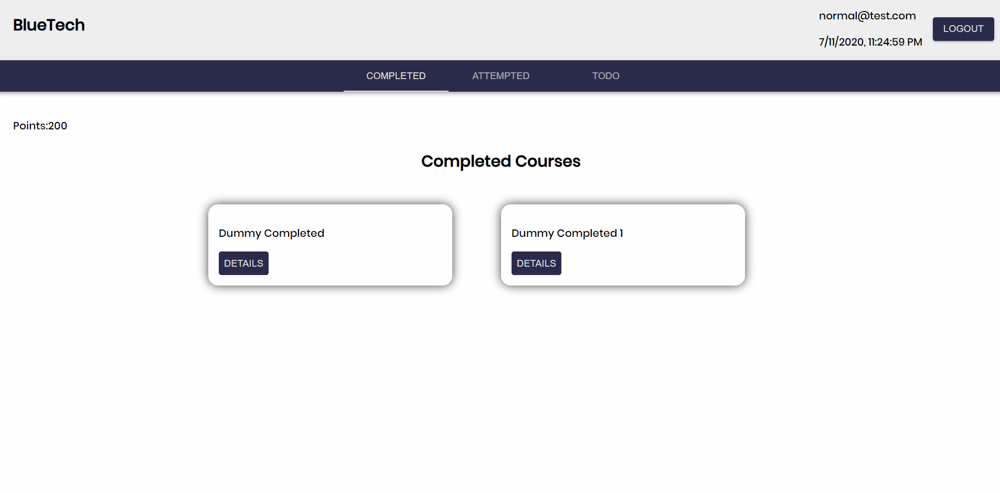

# Assignment

### Front-end

> ReactJS

### Back-end

> NodeJS

### Database

> MongoDB

### UI Framework

> Material-UI

---

I have used IndexedDB to store the dummy data.
For the courses I've considered dummy data of the following structure

>                name:
>                status:
>                points:
>                dueDate:
>                dateOfCompletion:

---

I've completed the mandatory portion and this is how the normal user's dashboard looks like

[Portfolio](https://mritunjaysaha.netlify.app)
